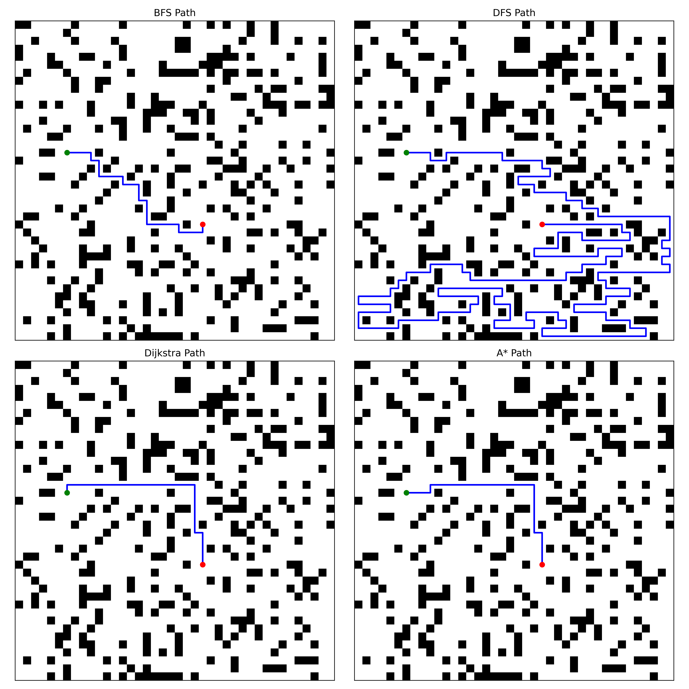
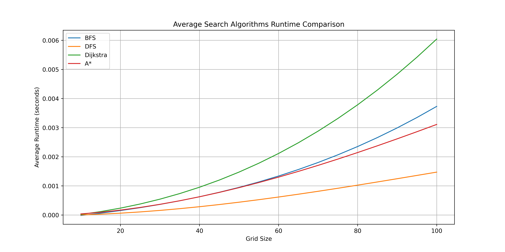

# Search Algorithms

This document contains implementations and benchmarks for several search algorithms including BFS, DFS, Dijkstra's, and A* algorithms, specifically designed for COMP3821.

## Features
- **Scripts for Visualization**: Visualize how each algorithm explores the search space.
- **Benchmark Scripts**: Compare performance metrics like runtime and memory usage across algorithms.

## Sample Outputs
### Visualized Paths


### Performance Benchmark


## Getting Started
### Prerequisites
Ensure you have `python` and `pip` installed on your machine. Then, install the necessary dependencies:
```
pip install -r requirements.txt
```
### Running the Scripts
To generate the images and performance data, execute the provided shell script:
```
./run.sh
```

**NOTE**: See `main.py` for possible arguments and `run.sh` for examples of how to use them.


